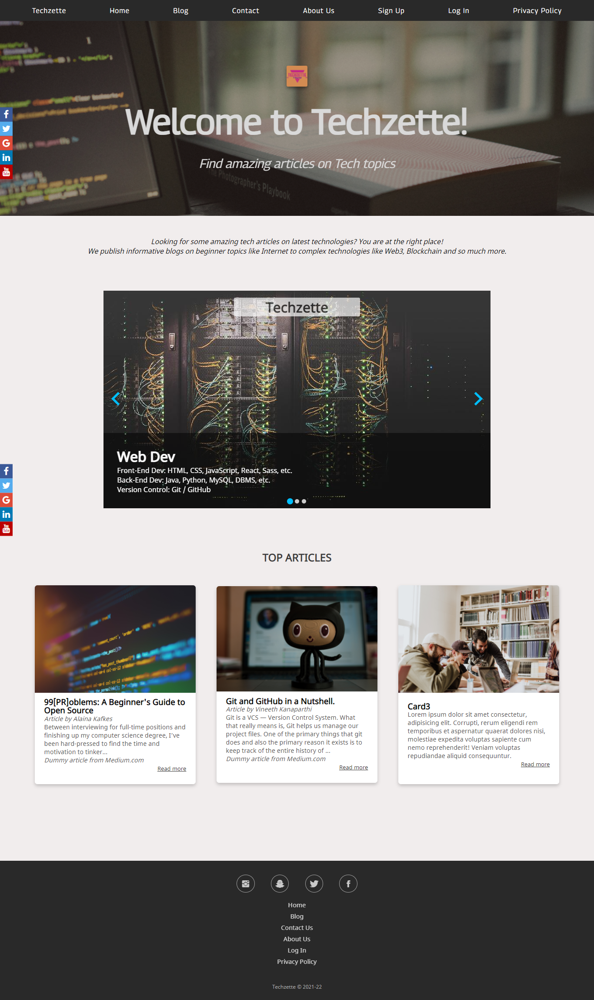
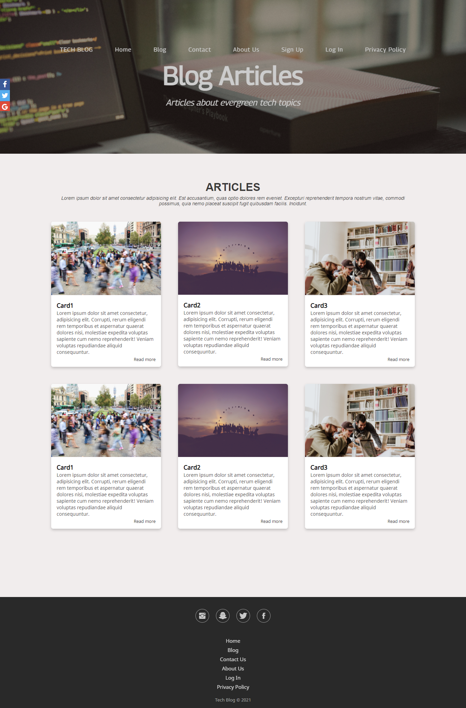
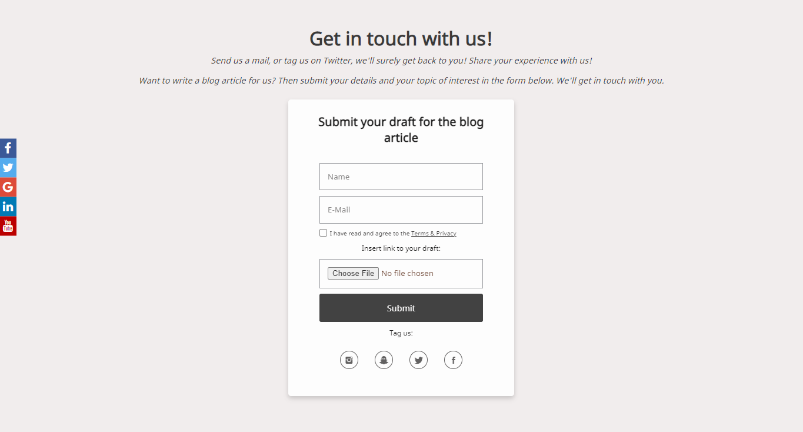
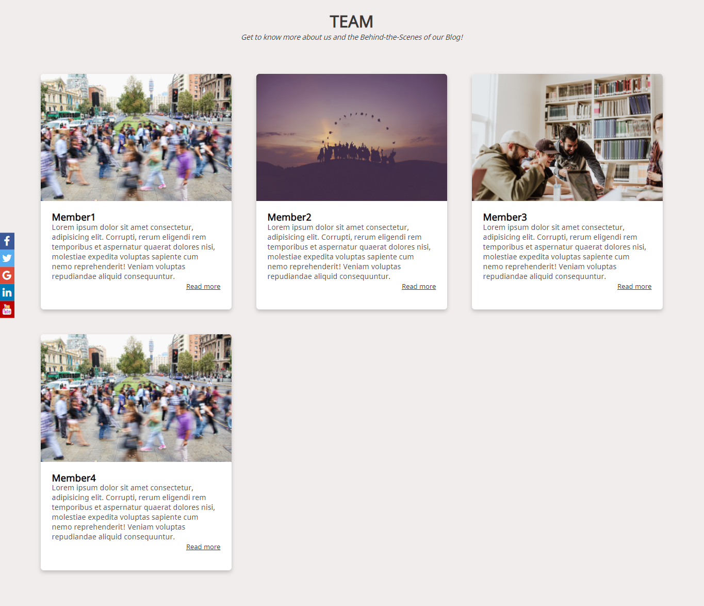

# Project-Work : Techzette
Tech Blog Website : Web Development Project 

View this project on GitHub Pages : [Techzette](https://swatiaf.github.io/techzette-blog/)

'Techzette Blog' Website is a blogging website based on Tech Community and Topics. 

## Technologies used

## Preview
Built using HTML and CSS, the template for all the webpages is similar, with navigation bar, header and header image, body and a footer.

### Home Page 
- Header section consists of Navigation Bar and Header Image. Navigation Bar is made up of FlexBox Layout, with Header Image acting as a background for the text related to the 
page. This section is similar in all webpages throughout the website.
- Image Slider consists of article topics which are regarding latest technologies and trending topics. This slider is made of a JavaScript Framework called Splide.js. This component is made using JavaScript and TypeScript. 
- Next section consists of 'Top Aticles' of the blog, in a Grid Layout.
- Footer consists of Social Media Icons, Page Links, and also copyrights. This is also similar in all pages.
- Every page also consists of a Social Media Icon Bar at the very left of the page and stays at the center of the viewport when scrolling the page.

### Blog Page
- Header section has a similar layout as the home page.
- Blog Section consists of the articles present in the blog. This section is designed in the layout of Grid.

### Contact Page
- This is also a templated page, with similar components as all other pages in the website.
- The form in this page is used to submit documents/drafts of the articles written by the users. User can also share and tag their articles on social media.
- This form is also validated using JavaScript. Form cannot be submitted without making sure of the following things: 
  - Name input cannot be left empty.
  - Email cannot be left empty and cannot be entered in a wrong format.
  - Checkbox for having read Privacy Policy and Terms & Conditions cannot be left unchecked.
  - File upload cannot be left empty.

### About Us

### Sign in page

### Log In Page

