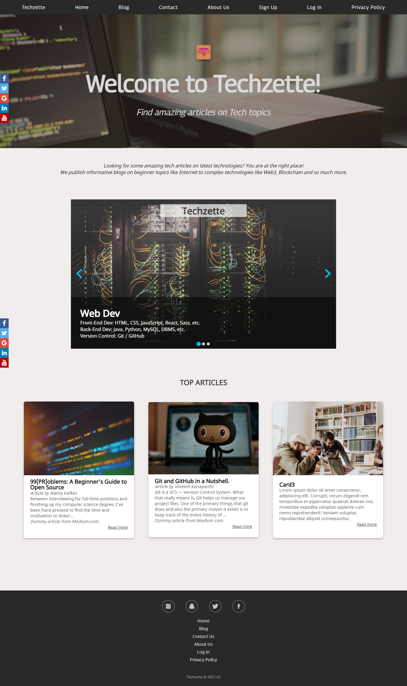
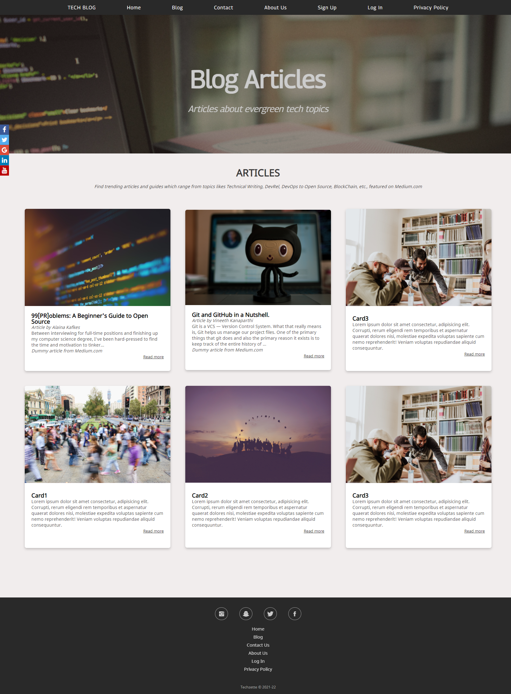
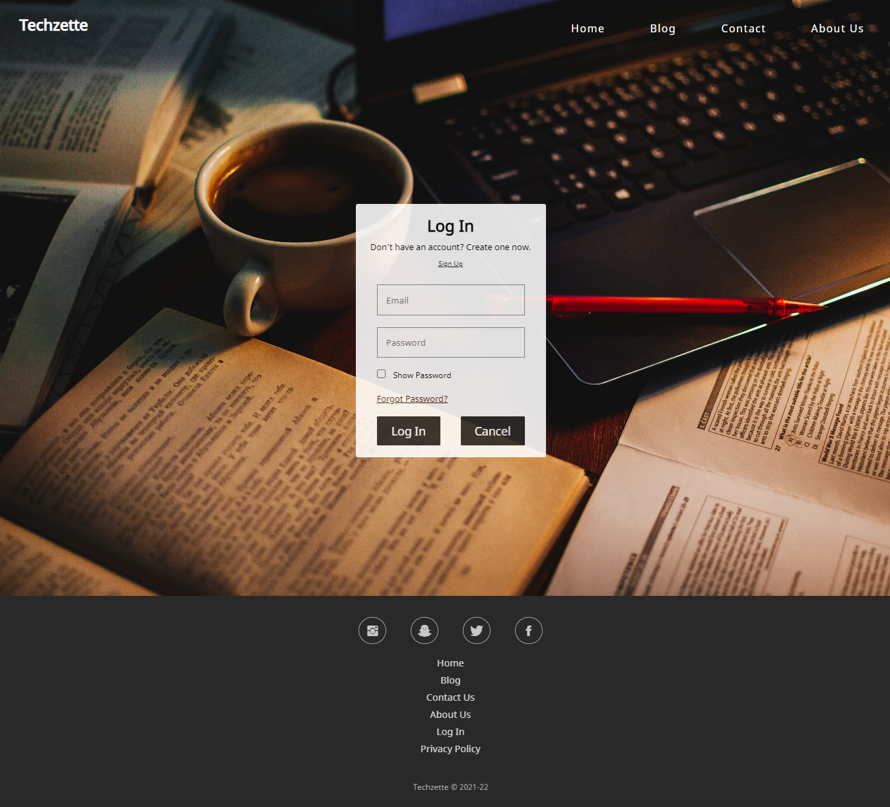
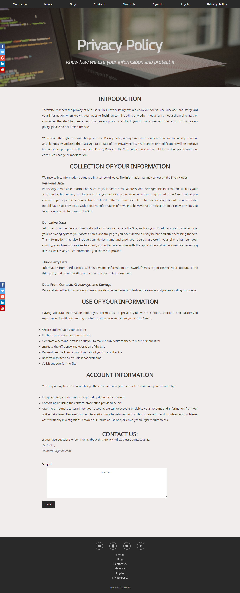
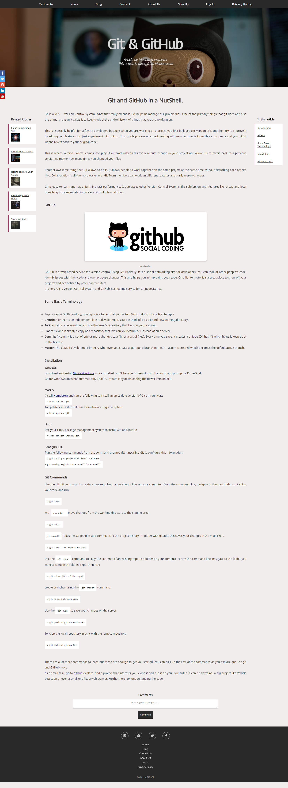

  
# Project-Work : Techzette
  

Tech Blog Website : Web Development Project

'Techzette Blog' Website is a blogging platform based on Tech Community and Topics. Our Blog allows the users to read articles and documentations as well as write for us. Our users get special featured articles. 

*View this project hosted on GitHub Pages : [Techzette](https://swatiaf.github.io/techzette-blog/)*

## Technologies used

  
*[Splide](https://splidejs.com/) is a lightweight, flexible and accessible slider/carousel written in TypeScript. No dependencies, no Lighthouse errors*

  
## Preview

Built using HTML and CSS, the template for all the webpages is similar, with navigation bar, header and header image, body and a footer.
  

  
### Home Page 
  

- Header section consists of Navigation Bar and Header Image. Navigation Bar is made up of FlexBox Layout, with Header Image acting as a background for the text related to the 
page. This section is similar in all webpages throughout the website.
- Image Slider consists of article topics which are regarding latest technologies and trending topics. This slider is made of a JavaScript Framework called Splide.js. This component is made using JavaScript and TypeScript. 
- Next section consists of 'Top Aticles' of the blog, in a Grid Layout.
- Footer consists of Social Media Icons, Page Links, and also copyrights. This is also similar in all pages.
- Every page also consists of a Social Media Icon Bar at the very left of the page and stays at the center of the viewport when scrolling the page.

  
### Blog Page
  

- Header section has a similar layout as the home page.
- Blog Section consists of the articles present in the blog. This section is designed in the layout of Grid.

  
### Contact Page
  

- This is also a templated page, with similar components as all other pages in the website.
- The form in this page is used to submit documents/drafts of the articles written by the users. User can also share and tag their articles on social media.
- This form is also validated using JavaScript. Form cannot be submitted without making sure of the following things: 
  - Name input cannot be left empty.
  - Email cannot be left empty and cannot be entered in a wrong format.
  - Checkbox for having read Privacy Policy and Terms & Conditions cannot be left unchecked.
  - File upload cannot be left empty.

  
### About Us
  

- The About Us page basically allows a peek behind the curtains of the website where the information about the members behind the project is provided. 
- It also tells the users not only about the members involved in this website but also about the information that the website provides the users.

  
### Sign in page

- This page consists of a Sign in form which is validated using JavaScript before submission. 
  - Name input cannot be left empty.
  - Email cannot be left empty and cannot be entered in a wrong format.
  - Checkbox for having read Privacy Policy and Terms & Conditions cannot be left unchecked.
  - It also has a checkbox for showing password.
  - Password is validated for 
    - it cannot be left empty, and cannot be less than 7 characters.
    - password cannot be a string of consecutive numbers, like '1111111', '2222222', ...., '1234567', '01234567', etc.
    - password cannot be as same as 'PASSWORD', 'password', and email address.
    - password should be a string that consists of at least one special character, lower case alphabet, upper-case alphabet and a number.

  
### Log In Page
  

- This page consists of a Log in form which is validated using JavaScript before submission. 
  - Email cannot be left empty and cannot be entered in a wrong format.
  - It also has a checkbox for showing password.
  - Password is validated for 
    - it cannot be left empty, and cannot be less than 7 characters.
    - password cannot be a string of consecutive numbers, like '1111111', '2222222', ...., '1234567', '01234567', etc.
    - password cannot be as same as 'PASSWORD', 'password', and email address.
    - password should be a string that consists of at least one special character, lower case alphabet, upper-case alphabet and a number.
   

  
### Privacy Policy Page
  

- Privacy Policy page is to show users the way in which we use their information and how we protect their assets.

  
### Article Page
  

This shows a dummy article taken from [Medium.com](https://medium.com), [Git and GitHub in a NutShell, by Vineeth Kanaparthi](https://medium.com/codeburst/git-and-github-in-a-nutshell-b0a3cc06458f)

[99 [PR]oblems: A Beginner’s Guide to Open Source, by Alaina Kafkes](https://medium.com/clarifai-champions/99-pr-oblems-a-beginners-guide-to-open-source-abc1b867385a)

- It consists of side menu on the right, suggesting other topics and related articles.
- The Side menu on the left, displays the list of topics and headings present in the article, for easier navigation within the article.

  
## Future Enhancements
  

- **Responsive:** This project will be made Responsive for all sizes of screens, from Computer screens to mobile phones
- **Accessible:** To ensure this project reaches all, it will be made as accessible as possible so that people who use screen-readers and color-blind people can also use it.
- **Full Fledged Blog:** pairing it with databases, this front-end can be connected to back-end, to make it a fully fledged blog.
- **Improved UI design & features:** Improved UI design to make it more minimalistic and modern along with Dark theme feature.
- **Dynamic:** This platform can be made more dynamic with JavaScript and add other dynamic features.
- **Search Bar:** Search bar that can search articles based on topic tags.

  
## Resources & References
  

- *Photos were selected from [Unsplash.com](https://unsplash.com)*
- *Logo was created and edited using [Canva.com](https://www.canva.com)*
- *Splide.js library for Image Slider component in the Home page, inserted from [Splide.js](https://splidejs.com)*
- *Social Media icons were taken from [Bootstrap](https://getbootstrap.com)*

